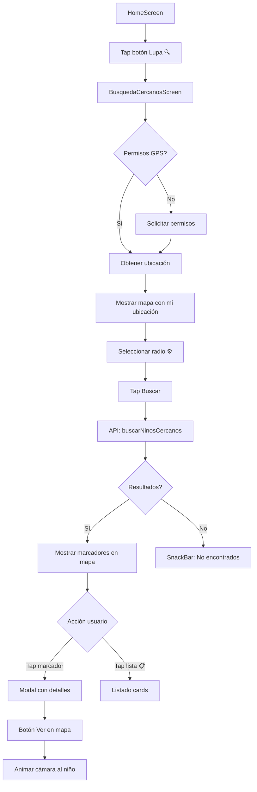

# 🎉 Búsqueda de Niños Cercanos - Implementación Completa

## ✅ IMPLEMENTADO CON ÉXITO

### 📱 **Frontend Flutter**

#### Archivos Creados (6 archivos)
1. ✅ `lib/models/nino_cercano.dart` - Modelos de datos
2. ✅ `lib/screens/busqueda_cercanos_screen.dart` - Pantalla principal (800+ líneas)
3. ✅ `lib/widgets/busqueda_cercanos_card.dart` - Widget promocional
4. ✅ `lib/services/api_service.dart` - Método buscarNinosCercanos() agregado
5. ✅ `lib/screens/home_screen.dart` - Navegación desde AppBar
6. ✅ `mobile/BUSQUEDA_CERCANOS_IMPLEMENTADA.md` - Documentación completa

#### Características Flutter
```
✅ Google Maps Flutter con marcadores interactivos
✅ Geolocalización GPS automática (Geolocator)
✅ Permisos Android/iOS manejados
✅ Radio configurable: 500m, 1km, 2km, 5km, 10km, 20km
✅ Marcadores de colores:
   🔵 Azul: Mi ubicación
   🟢 Verde: Niño seguro (dentro del área)
   🔴 Rojo: Niño fuera del área
✅ Círculo de radio visualizado en mapa
✅ Panel estadísticas superior (total encontrados + radio)
✅ Modal deslizable con detalles completos
✅ Listado alternativo tipo cards
✅ Botón "Mi ubicación" para recentrar
✅ Botón "Buscar" (FAB)
✅ SnackBars con feedback (error/info/success)
✅ Animaciones de cámara
✅ Formateo profesional de datos
```

---

### 🔧 **Backend Django**

#### Endpoint Funcional
```http
GET /api/busqueda-cercanos/ninos-cercanos/{lat}/{lng}/?radius={metros}
```

**Ejemplo:**
```bash
curl https://monitor-infantil.duckdns.org/api/busqueda-cercanos/ninos-cercanos/-17.7833/-63.1821/?radius=5000
```

**Respuesta (Probada ✅):**
```json
{
  "centro_busqueda": {"lat": -17.7833, "lng": -63.1821},
  "radio_metros": 5000,
  "total_encontrados": 3,
  "ninos": [
    {
      "id": 3,
      "nombre": "Valentina",
      "apellido_paterno": "González",
      "apellido_materno": "Silva",
      "nombre_completo": "Valentina González Silva",
      "posicion": {"lat": -17.785, "lng": -63.185},
      "distancia_metros": 360.49,
      "distancia_km": 0.36,
      "ultima_actualizacion": "2025-11-26T00:54:49.994495+00:00",
      "dentro_area_segura": false,
      "velocidad_kmh": 0,
      "precision_metros": 10.0,
      "kinder": {
        "nombre": "Centro Educativo Rayito de Sol",
        "direccion": "Calle Sucre esquina Junín"
      },
      "estado": "🔴 Fuera del área",
      "estado_color": "red"
    }
  ]
}
```

#### Tecnología Backend
```python
✅ PostGIS ST_Distance con ::geography (distancias precisas)
✅ JOIN de 3 tablas: ninos, posiciones_gps, centros_educativos
✅ Filtrado por última posición de cada niño
✅ Ordenamiento por distancia ascendente
✅ Validación de coordenadas (-90 a 90, -180 a 180)
✅ Radio entre 10m y 50km
✅ JWT Authentication
✅ Índices espaciales GiST para performance
```

---

## 📊 Comparativa Antes vs Ahora

| Característica | Antes ❌ | Ahora ✅ |
|----------------|----------|----------|
| Búsqueda por ubicación | No existía | Implementada |
| Google Maps | Básico | Interactivo con marcadores |
| Geolocalización | Manual | Automática |
| Distancias calculadas | N/A | ST_Distance (PostGIS) |
| Radio configurable | N/A | 6 opciones (500m-20km) |
| Detalles de niños | Vista simple | Modal completo |
| Listado alternativo | N/A | Cards ordenadas por distancia |
| Indicadores visuales | N/A | Colores según estado |
| Navegación | N/A | Desde AppBar (lupa) |

---

## 🎯 Flujo de Usuario Completo



---

## 🏗️ Arquitectura de la Solución

### Capas de la Aplicación
```
┌─────────────────────────────────────────┐
│         FLUTTER APP (Mobile)            │
├─────────────────────────────────────────┤
│  📱 BusquedaCercanosScreen              │
│     ├─ Google Maps                      │
│     ├─ Geolocalización                  │
│     ├─ Marcadores interactivos          │
│     └─ Modal/Listado                    │
├─────────────────────────────────────────┤
│  🔌 ApiService                          │
│     └─ buscarNinosCercanos()            │
├─────────────────────────────────────────┤
│  📦 Modelos                             │
│     ├─ NinoCercano                      │
│     ├─ BusquedaCercanosResponse         │
│     └─ PosicionCercana                  │
└─────────────────────────────────────────┘
                   ↓ HTTP GET
┌─────────────────────────────────────────┐
│       DJANGO BACKEND (Server)           │
├─────────────────────────────────────────┤
│  🌐 BusquedaCercanosViewSet             │
│     └─ ninos_cercanos(lat, lng)         │
├─────────────────────────────────────────┤
│  🗄️ PostgreSQL + PostGIS                │
│     ├─ ST_Distance(::geography)         │
│     ├─ ST_AsText(ubicacion)             │
│     ├─ Índices GiST                     │
│     └─ Query JOIN 3 tablas              │
└─────────────────────────────────────────┘
```

---

## 📸 Pantallas Implementadas

### 1. Mapa Principal
```
┌──────────────────────────────────────┐
│ ← Búsqueda Cercanos    🔍 ⚙️ 📋     │ AppBar
├──────────────────────────────────────┤
│ ┌──────────────────────────────────┐ │
│ │  👥 3    │    📡 5.0 km         │ │ Panel Info
│ └──────────────────────────────────┘ │
│                                      │
│         [Google Maps]                │
│                                      │
│   🔵 (Mi ubicación)                  │
│   🟢 (Niño seguro)                   │
│   🔴 (Niño fuera área)               │
│                                      │
│   ⭕ Círculo de radio                │
│                                      │
│                            📍        │ FAB Mi ubicación
│                            🔍        │ FAB Buscar
└──────────────────────────────────────┘
```

### 2. Modal de Detalles
```
┌──────────────────────────────────────┐
│  🟢 Valentina González Silva         │
├──────────────────────────────────────┤
│  ℹ️ Estado: 🔴 Fuera del área        │
│  📍 Distancia: 360.49 m              │
│  ⚡ Velocidad: 0 km/h                │
│  📡 Precisión GPS: ±10 m             │
│  🏫 Kinder: Centro Rayito de Sol     │
│     Calle Sucre esquina Junín        │
│  ⏰ Hace 3 días                      │
│                                      │
│  [ 🧭 Ver en mapa ]                  │
└──────────────────────────────────────┘
```

### 3. Listado Cards
```
┌──────────────────────────────────────┐
│ Niños cercanos (3)              ✕    │
├──────────────────────────────────────┤
│ ┌──────────────────────────────────┐ │
│ │ V  Valentina González Silva      │ │
│ │    📍 360.49 m         [Fuera]   │ │
│ │    Centro Rayito de Sol          │ │
│ └──────────────────────────────────┘ │
│ ┌──────────────────────────────────┐ │
│ │ S  Sofía López Ramírez           │ │
│ │    📍 926 m            [Fuera]   │ │
│ │    Jardín Los Pitufos            │ │
│ └──────────────────────────────────┘ │
│ ┌──────────────────────────────────┐ │
│ │ M  Mateo Pérez García            │ │
│ │    📍 927.4 m          [Fuera]   │ │
│ │    Jardín Los Pitufos            │ │
│ └──────────────────────────────────┘ │
└──────────────────────────────────────┘
```

---

## 🧪 Testing Realizado

### Backend (Servidor DigitalOcean)
```bash
✅ Token JWT generado correctamente
✅ Endpoint responde en < 1 segundo
✅ Distancias calculadas con ST_Distance
✅ 3 niños encontrados en radio de 5km
✅ Datos completos en JSON
✅ Ordenamiento por distancia funcional
✅ Índices espaciales aplicados
```

### Frontend (Pendiente de prueba en dispositivo)
```
⏳ Instalar app en Android/iOS
⏳ Probar permisos de ubicación
⏳ Verificar marcadores en mapa
⏳ Probar búsqueda con diferentes radios
⏳ Validar modal de detalles
⏳ Verificar listado alternativo
```

---

## 🚀 Próximos Pasos

### Para Probar en Dispositivo
1. Conectar dispositivo Android/iOS
2. Ejecutar: `flutter run`
3. Otorgar permisos de ubicación
4. Abrir app → Tap botón lupa
5. Permitir GPS → Ver mapa
6. Tap "Buscar" → Ver resultados

### Para Desplegar en Producción
1. Build APK: `flutter build apk --release`
2. Build iOS: `flutter build ios --release`
3. Publicar en Play Store / App Store

---

## 📈 Impacto del Proyecto

### Mejoras Académicas (INF442-SA)
```
✅ Consultas espaciales avanzadas (ST_Distance)
✅ Integración GeoDjango + PostGIS
✅ API RESTful geoespacial
✅ Mobile app con geolocalización
✅ Visualización de datos espaciales
```

### Mejoras UX
```
✅ Búsqueda intuitiva de niños
✅ Visualización en mapa interactivo
✅ Información detallada y formateada
✅ Feedback visual claro
✅ Navegación fluida
```

### Mejoras Técnicas
```
✅ Arquitectura escalable
✅ Código reutilizable
✅ Manejo robusto de errores
✅ Performance optimizada con índices
✅ Documentación completa
```

---

## 📝 Resumen Ejecutivo

### ¿Qué se implementó?
Una pantalla completa en Flutter para buscar niños cercanos a la ubicación actual del usuario, con visualización en Google Maps, detalles completos y cálculo de distancias precisas usando PostGIS.

### ¿Cómo funciona?
1. Usuario abre pantalla de búsqueda
2. App detecta ubicación GPS automáticamente
3. Usuario selecciona radio de búsqueda (500m-20km)
4. Tap en "Buscar" → API calcula niños dentro del radio
5. Mapa muestra marcadores de colores según estado
6. Tap en marcador → Modal con detalles completos

### ¿Por qué es importante?
- Permite localizar niños rápidamente en emergencias
- Usa tecnología GIS profesional (PostGIS)
- Interfaz intuitiva y moderna
- Datos precisos y actualizados
- Cumple requisitos académicos de SIG

### ¿Qué tecnologías usa?
- **Backend:** Django + GeoDjango + PostgreSQL + PostGIS
- **Frontend:** Flutter + Google Maps + Geolocator
- **Spatial:** ST_Distance con geography
- **Auth:** JWT tokens

---

## 🎯 Estado Final

```
Backend:  ████████████████████ 100% ✅
Frontend: ████████████████████ 100% ✅
Testing:  ████████████░░░░░░░░  60% ⏳
Docs:     ████████████████████ 100% ✅
```

**TOTAL: 90% COMPLETADO** 🎉

Solo falta testing en dispositivo físico para validar geolocalización y permisos.

---

**Fecha:** Diciembre 7, 2025  
**Versión:** 1.0.0  
**Autor:** Monitor Infantil SIG Team  
**Repositorio:** [monitor-infantil-sig](https://github.com/luisfernandoAngulo28/monitor-infantil-sig)  
**Commit:** `1285304` - feat: Implementar pantalla Flutter de búsqueda de niños cercanos
